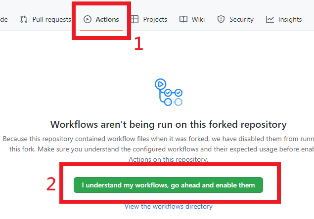
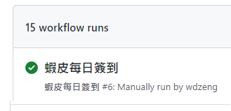
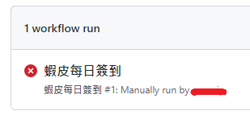

# 蝦皮簽到機器人使用說明

這篇文章說明如何使用 GitHub Actions 架設屬於自己的蝦皮簽到機器人。

## 須知

1. 如果你使用了機器人之後發現架不起來或不適用，請[關閉機器人](#關閉機器人)，不要放著機器人每天跑、每天失敗。Actions 是 GitHub 提供給大家的免費資源，請發揮公德心，珍惜使用。
2. GitHub Actions 排程極容易出現長達數小時的延誤，這是正常現象，因為使用的人實在太多了。所以如果你發現機器人沒有準時執行，請再等一段時間。
3. 如果你有任何疑問，在詢問開發者之前，請先看過[疑難排解](shopee-issues.md)。此外，可以逛逛 [issues](https://github.com/wdzeng/bot-automation/issues?q=)，說不定你遇到的問題已經有人遇過。
4. 除非涉及你的個人隱私或帳號密碼，否則請一律在 [issues](https://github.com/wdzeng/bot-automation/issues?q=) 發問。涉及隱私的問題可以參考我的[聯繫方式](../README.md#聯繫開發者)。
5. 請自行關注機器人更新，開發者不會主動發布通知。目前機器人剛上線，還在測試階段。待未來進入正式階段後，請**一定**要[更新機器人](#更新)，否則你的機器人會在兩個月後自動停用。

## 第一次手動簽到

以下是設定的詳細步驟；你也可以參考[瘋先生的文章](https://mrmad.com.tw/shopee-automatic-sign-in-robot)，他做的圖片比我漂亮多了。

不過，瘋先生文章底下提到，如果有看到 Pull Request（通知更新的意思），表示有更新。這點我補充一下：因為目前使用者人數太多，我現在已經沒有辦法一個一個發送更新通知了，未來也不會再主動通知更新。請使用者自行[關注更新](https://github.com/wdzeng/bot-automation#%E6%9B%B4%E6%96%B0)。

### 準備

你需要一個 GitHub 帳號，僅此而已喔！

### Fork 專案

請將這份專案 fork（複製之意）到你的帳號下，如果可以的話，請給我一個 star。

> 
>
> 請選擇右上角的 Fork 按鈕

- 不要 fork shopee-coins-bot，那是原始碼專案，你不會需要它。要 fork 你現在在看的這份專案 bot-automation 才對。
- 不要 fork shopee-coins-bot，那是原始碼專案，你不會需要它。要 fork 你現在在看的這份專案 bot-automation 才對。
- 不要 fork shopee-coins-bot，那是原始碼專案，你不會需要它。要 fork 你現在在看的這份專案 bot-automation 才對。

因為很重要所以要說三遍。

> 
>
> 按 Create fork

沒有意外的話，你的專案網址會是 https://github.com/你的_GitHub_ID/bot-automation。

### 設定帳號、密碼與加密金鑰

這個機器人將來會需要你的 cookie 來做自動登入，cookie 將會儲存在你的專案上。但是，GitHub 專案上的東西都是公開的，因此我們需要對 cookie 進行加密。

1. 到[這個網站](https://freeaeskey.xyz/)生成一份金鑰，這份金鑰是用來加密你的 cookie 用的。金鑰不要外流，會被盜帳。

    > 

    事實上金鑰就只是 64 個隨機 0-9 和 a-f 的英數字組成而已，你要自己生也行。

2. 進入你的專案的 Settings 設定頁面，然後選擇左邊 Secrets 下的 Actions 選項，然後按 New repository secret 按鈕。

    > 

3. 你會看到有 Name 欄位和 Value 欄位。填寫需要的資料如下。因為有三份資料，所以這個步驟要執行三次。

    | Name 欄位 | Value 欄位 |
    | ------ | ----- |
    | `SHOPEE_USERNAME` | 蝦皮帳號，可以是電子信箱、手機號碼或 ID。 |
    | `SHOPEE_PASSWORD` | 蝦皮密碼。 |
    | `AES_KEY` | 步驟 1. 產生的金鑰。 |

    > 

### 設定機器人的權限

至專案設定的 Actions/General 頁面，滑到最下方選擇 "Read and write permissions"。

   > 

### 啟動機器人

1. 請到 Actions 頁面，啟用 workflow 功能。

    > 

2. 接著進行第一次手動機器人簽到。

    > 

3. 等待大約 10 秒（或重新整理網頁），你會看到機器人已經開始運行。沒意外的話你很快會收到簡訊驗證，希望啦。

    > 

4. 簡訊驗證後，機器人應該會很快成功簽到，如下圖。

    > 

   如果失敗，會呈現下圖。請參考[疑難排解與錯誤回報](shopee-issues.md)。

   > 

至此，我們已經完成第一次手動機器人簽到。

## 設定自動簽到

第一次手動簽到成功後，**每天凌晨 00:10 機器人會開始自動進行簽到**。不用再做其他設定了！

> **Warning**
>
> GitHub Action 的排程極常出現嚴重延誤的情況，因為很多人在用，而且是免費的。延誤時間通常落在數個小時，但通常不會超過六小時。如果你發現機器人沒有準時運作，請不用太過擔心，請再等一段時間看看！

要查看每日簽到的結果，可以至你的專案 Actions 頁面檢查。

## 更新機器人

請參考[這裡](../README.md#更新)。

## 關閉機器人

關掉機器人的方法如下：

日後要重新開啟時，按照同樣的步驟恢復即可。
